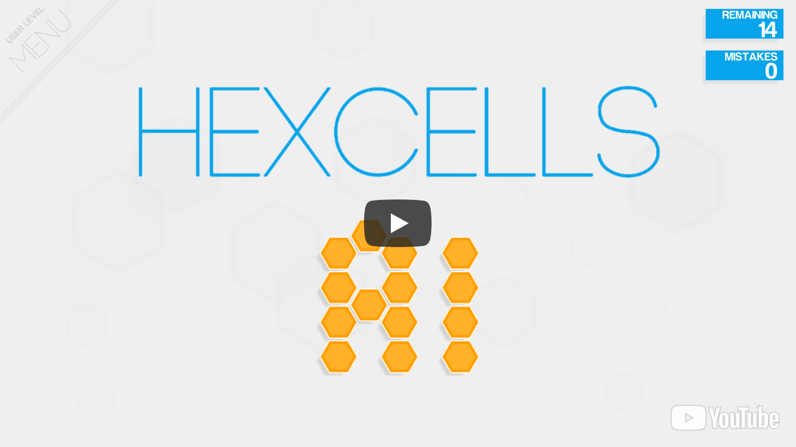
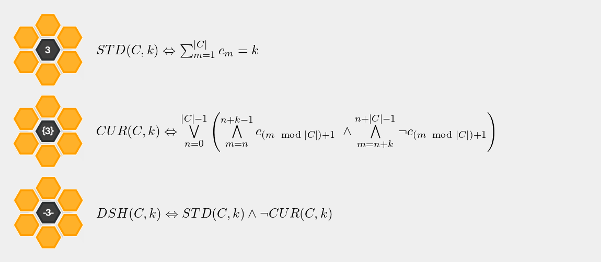
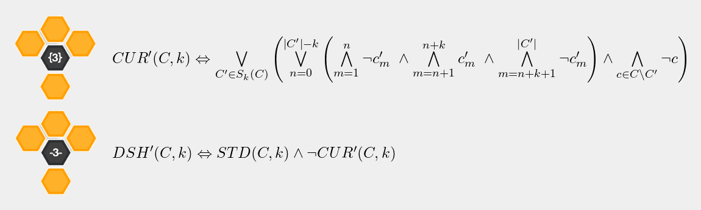
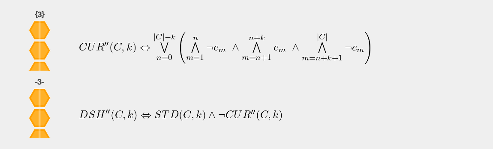

# Hexcells AI
 - [Hexcells](https://en.wikipedia.org/wiki/Hexcells) is similar to Minesweeper just with hexagons and a few additional rules
 - This AI perfectly solves every level of the game with the help of a [SAT](https://en.wikipedia.org/wiki/Boolean_satisfiability_problem) solver
 - The game elements are detected with OpenCV's template matching and contour detection functionality 
 
## Example

<a href="https://youtu.be/nsLqn2fvYdA" target="_blank">  </a>

## How It Works
 - The game is reduced to [SAT](https://en.wikipedia.org/wiki/Boolean_satisfiability_problem) and then solved using a SAT solver
 - Every hexagon is a boolean variable
   - If the variable is true the hexagon is blue and vice versa
 - The constraints imposed by the hints (such as `k`, `{k}`, or `-k-`) are encoded in a boolean formula `B`
   - By definition this formula is satisfiable since there exists a solution to the game
 - `A` contains the truth values of the non orange hexagons i. e. the hexagons whose truth value is already known / determined
 - The true value of a orange hexagon is then determined by contradiction
   - E. g. in order to test if a hexagon is blue, it is assumed that this hexagon is not blue. 
     If it this makes the boolean formula `B` unsatisfiable then the hexagon must be blue.
     If the boolean formula is still satisfiable then the truth value of that hexagons remains unknown.
 - The following algorithm repeatedly tries to determine the the truth value of for each hexagon 
   until all truth values have been determined 
   - Note that the game is always solvable without guessing. 
     Therefore, there always exists at least one hexagon whose truth value can be determined.

```
given the set of hexagons H

encode already known constraints into B
add already known truth values to A

while there are hexagons whose truth value is unknown i. e. |A| < |H|:
  A' = Ø
  for h in H:
    if the truth value of h is already known:
      continue
    if B given A ∪ {h ≡ false} is unsatisfiable:
      -> h is blue
      A' = A' ∪ {h ≡ true}
    elif B given A ∪ {h ≡ true} is unsatisfiable:
      -> h is not blue
      A' = A' ∪ {h ≡ false}
  A = A ∪ A'
  encode new constraints into B
```

### Encodings

<!--- comment

Fontsize 35

{STD}(C, k) \Leftrightarrow \sum_{m=1}^{\left|C\right|}c_m=k

{CUR}(C, k) \Leftrightarrow 
\bigvee\limits_{n=0}^{\left|C\right|-1}
\left(
\bigwedge\limits_{m=n}^{n+k-1} c_{(m \mod \left|C\right|)+1}
\text{ } \wedge 
\bigwedge\limits_{m=n+k}^{n + \left|C\right| - 1}\neg c_{(m \mod \left|C\right|)+1}
\right)

{DSH}(C, k) \Leftrightarrow \neg CUR(C, k) \wedge {STD}(C, k)

--->

Assume that `k`, `{k}`, or `-k-` is a constraint. 
Additionally assume that `C` is the sorted set of hexagons influenced by the constraint,
`c_m` is the `m`-th element of `C`,
and that `k` is the number hexagons that should be blue.

Then the constraints can be encoded into boolean formulas as follows:

<div align="center"> </div>

<!--- comment

{CUR}'(C, k) \Leftrightarrow 
\bigvee\limits_{C'\in S}
\left(
\bigvee\limits_{n=0}^{\left|C'\right|-k}
\left(
\bigwedge\limits_{m=1}^{n}\neg c'_m
\text{ } \wedge 
\bigwedge\limits_{m=n+1}^{n+k} c'_m
\text{ } \wedge 
\bigwedge\limits_{m=n+k+1}^{\left|C'\right|}\neg c'_m
\right)
\wedge
\bigwedge\limits_{c'\in C\setminus C'} \neg c'
\right)

{DSH}'(C, k) \Leftrightarrow \neg CUR'(C, k) \wedge {STD}(C, k)

--->

Also note that gaps do count as such. Therefore, if there are gaps, the formulas have to be slightly adapted.

Let `S ⊂ 2^C` be the set of subsets of `C` of size greater or equal to `k` in which all hexagons are connected (i. e. there are no gaps between the hexagons).

<div align="center"> </div>

<!--- comment

{CUR}''(C, k) \Leftrightarrow 
\bigvee\limits_{n=0}^{\left|C\right|-k}
\left(
\bigwedge\limits_{m=1}^{n}\neg c_m
\text{ } \wedge 
\bigwedge\limits_{m=n+1}^{n+k} c_m
\text{ } \wedge 
\bigwedge\limits_{m=n+k+1}^{\left|C\right|}\neg c_m
\right)

{DSH}''(C, k) \Leftrightarrow \neg CUR''(C, k) \wedge {STD}(C, k)

--->

Also note that for lines, the formulas also have to be slightly adapted and that gaps do not count as such (i. e. they are ignored).

<div align="center"> </div>

## Detection of Game Elements
 - I wanted to detect the game elements with classical computer vision methods, instead of neural networks
 - The following game elements need to be detected
   - The game's window
   - The hexagons
     - Including their type, the numbers within, and which hexagons neighbour which
   - The line hints given for a line of hexagons
     - Including the hexagons which are affected by the line hint
   - The number of remaining blue hexagons, given in the top right corner
 - It is assumed that the game is in windowed mode, has a resolution of 1440x900, the brightness is set to 100%, and that the game is not in "night mode".
 - In order to detect the game elements, first a screenshot is made
 - The position of the window is determined by finding the "[REMAINING](REMAINING.png)" lettering in the top right corner of the game using the `pyautogui.locateOnScreen` function
 - Thresholding is used to segment the foreground and the background
 - The contours of the foreground objects are detected with `cv2.findContours`
   - Every contour with a contour area between 1500 and 1700 is classified as hexagon
 - The type of hexagon (i. e. orange, dark, blue, or blue w/ number) is simply detected by its color
 - The lettering on the hexagon is detected by matching it to one of the [templates](templates)
 - The neighboring hexagons are determined by the distance of their centers
 - Around each hexagon it is searched for a line hint
   - The lettering is then detected by matching it to one of the [templates](templates)
 - The number of remaining blue hexagons is also detected by matching it to one of the [templates](templates)
 
# Usage

This project depends on the following packages

```
numpy
opencv-python
pyautogui
pysat
```

Make sure adjust the settings as follows:
 - Resolution: 1440x900
 - Brightness: 100%
 - Language: English
 - Night mode disabled
 - Blue hexagon is bound to the left mouse button
 
Also mind the following:
 - The executed python script, takes control over your mouse
   - If bugs occur, you may not be able to gain its control back
 - The detection of the game elements is not perfect and therefore the AI may fail
 - The AI does not work for levels 1-1 to 2-6 since the hexagons are larger in these levels

With that in mind you can try the AI on your own.
Start the game and select a level such that the "REMAINING" lettering can be seen in the top right.
Then execute the [solve.py](solve.py) script and bring the Hexcells window to front. 

```
python solve.py
```

